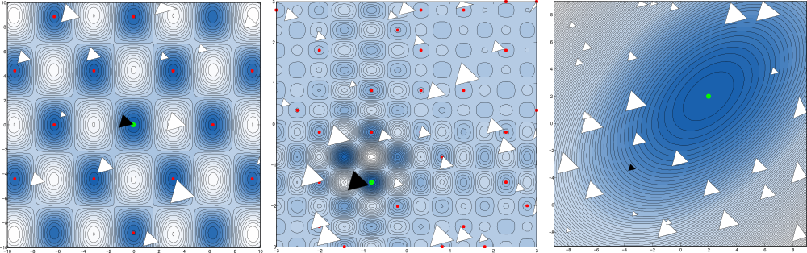

# Globalized Nelder-Mead method

This repository contains the MATLAB/Octave function `gbnm` that implements the algorithm described in this paper:

Luersen, Marco A., and Rodolphe Le Riche. "[Globalized Nelder–Mead method for engineering optimization](http://www.emse.fr/~leriche/gbnm_cas.pdf)." Computers & structures 82.23 (2004): 2251-2260.

As the title implies, it is a classical [Nelder-Mead method](https://en.wikipedia.org/wiki/Nelder%E2%80%93Mead_method) with some extras for dealing with multiple local optima.

## What does it do?

The Nelder-Mead algorithm, sometimes also called downhill simplex method, was originally published in 1965. It is an iterative algorithm for local, unconstrained minimisation of a non-linear function `f : R^n --> R`. In contrast to most other iterative algorithms, it does not rely on the derivative of the target function but only evaluates the function itself. This makes it extremely well suited for cases when the target function is not an algebraic term, but a simulation model which cannot be derived directly. It also does not approximate the function’s gradient but is based on geometrical projections of an n+1-point polygon — the simplex — in the n-dimensional parameter space of the target function. A simplex in two dimensions is a triangle, one in three dimensions is a tetrahedron. In general, the simplex can be represented as a matrix `S \in R^{n×n+1}` of its points:

    S = [x_0 ... x_N]  with each x_i \in R^n

The basic idea behind the simplex algorithm is that the worst point of `S`is replaced by a better one with a smaller function value and to repeat this operation iteratively until a local optimum has been found. To achieve this, three different transformations are applied to the simplex which let it move in directions of descent and shrink around a local minimum. These transformations are called reflection, expansion and contraction.

In each iteration, first the worst point is reflected at the centroid of the remaining points. Depending on the quality (good or bad) it then replaces the worst point in the simplex. If the reflected point is not better, it is withdrawn and the other fallback operations are executed.

The globalized Nelder-Mead method just generalizes this idea to find a global minimum. Instead of initialising the simplex once, multiple simplices are initialised and each one finds one local minimum. There are some tweaks to make the location of these simplices better than random, but principally they are spread randomly within the allowed boundaries.

## Usage

The function itself has the following signature:

    [x, fval, output, options] = gbnm(fun,xmin,xmax[, options])
    
### Arguments

    fun        A handle of the function to be minimized
    xmin       Column vector of lower bounds
    xmax       Column vector of upper bounds
    options    (optional) Structure with optimization algorithm parameters

### Return values

    x          The found global minimum
    fval       Function value at the found best minimum
    output     Structure with all found local minima and initial simplices
    options    Structure of parameters which were used during optimization
    
### Options

    options.maxRestarts = 15; % maximum (probablistic or degenerated) restarts
    options.maxEvals = 2500;  % maximum function evaluations
    options.nPoints = 5;      % number of random points per restart
    
    options.maxIter=250;      % maximum iterations per restart
    options.alpha = 1;        % reflection coeff
    options.beta = 0.5;       % contraction coeff
    options.gamma = 2;        % expansion coeff
    options.epsilon = 1e-9;   % T2 convergence test coefficient
    options.ssigma = 5e-4;    % small simplex convergence test coefficient
    
More details on the options and the can be found in the paper linked above.

## Practical considerations

This might become an FAQ section, if any Q's will being asked.

From my experience, the number of parameters `n` should be small, e.g. up to 5 or 6. In other words: this heuristics scales pretty badly with higher number of parameters.

As -- depending on the number of parameters `n` -- several thousand iterations (i.e. evaluations of function `fun`) are needed, its runtime should be as short as possible (as in fractions of a second).

## Copyright

Copyright (C) 2015  Johannes Dorfner

This program is free software: you can redistribute it and/or modify
it under the terms of the GNU General Public License as published by
the Free Software Foundation, either version 3 of the License, or
(at your option) any later version.

This program is distributed in the hope that it will be useful,
but WITHOUT ANY WARRANTY; without even the implied warranty of
MERCHANTABILITY or FITNESS FOR A PARTICULAR PURPOSE.  See the
GNU General Public License for more details.

You should have received a copy of the GNU General Public License
along with this program.  If not, see <http://www.gnu.org/licenses/>
